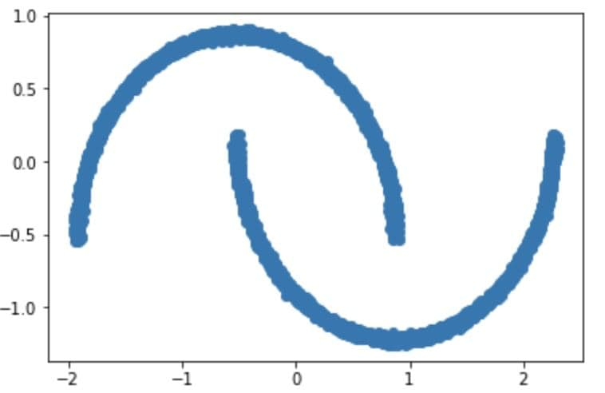
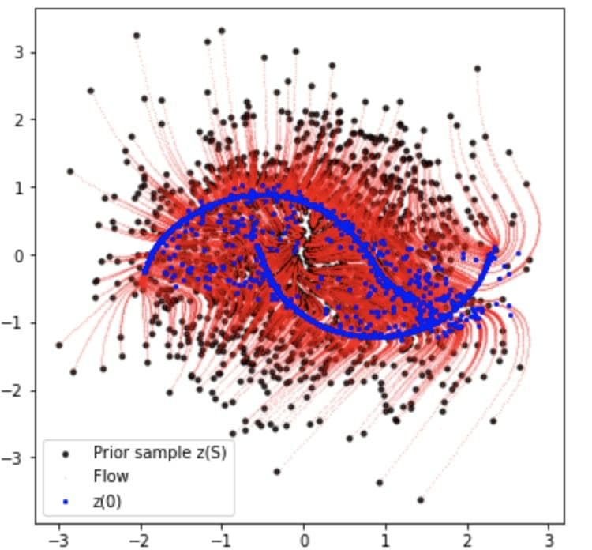

# Continuous Normalizing Flows
## Overview
The concept first introduced in Neural Ordinary Differential Equations paper ([arXiv](https://arxiv.org/pdf/1806.07366.pdf)). They proved Instantaneous Change of Variables theorm that states the change in log probability of a continuous random variable is equal to the trace of jacobin matrix:
<p align="center">
<a href="https://www.codecogs.com/eqnedit.php?latex=\frac{\partial\log&space;p(\boldsymbol{z}(t))}{\partial&space;t}&space;=&space;-Tr(\frac{df}{d\boldsymbol{z}(t)})" target="_blank"></a>
</p>
Computing the trace of the jacobian takes O(D^2) where D is the dimension of z(t). They reduced this cost to O(D) in FFJORD (https://arxiv.org/pdf/1806.07366.pdf) where an unbiased stochastic estimator of the trace is used.

<p align="center">
<a href="https://www.codecogs.com/eqnedit.php?latex=Tr(\frac{\partial&space;f}{\partial\boldsymbol{z}(t)})&space;=&space;\mathbb{E}_{p(\boldsymbol{\varepsilon})}[\boldsymbol{\varepsilon}^T\frac{\partial&space;f}{\partial\boldsymbol{z}(t)}\boldsymbol{\varepsilon}],&space;\quad&space;\boldsymbol{\varepsilon}&space;\sim&space;\mathcal{N}(0,&space;\boldsymbol{I})" target="_blank"></a>
</p>

## Implementation
I choose x in the equation x = f(z) from two moon distribution by following code:
```Python
def generate_two_moons(num_samples=200, noise=0.1):
  data, _ = sklearn.datasets.make_moons(n_samples=num_samples, noise=noise)
  return data[:,0:2]
  
x = generate_two_moons(10000, 0.01)
x = (x-x.mean())/np.std(x)
plt.scatter(x[:,0], x[:,1])
plt.show()
```
<p align="center">

</p>
By training a CNF model described as follows, a random variable z drawn from normal distribution transforms continuous in time to x.

```Python
    class CNF(nn.Module):
      def __init__(self, net, trace_estimator=None, noise_dist=None):
          super().__init__()
          self.func = net
          self.trace_estimator = trace_estimator;
          self.noise_dist, self.noise = noise_dist, None

      def forward(self, x):
          with torch.set_grad_enabled(True):
              x_in = torch.autograd.Variable(x[:,1:], requires_grad=True).to(x)
              x_out = self.func(x_in).to(x)
              trJ = self.trace_estimator(x_out, x_in, self.noise)
          return torch.cat([-trJ[:, None], x_out], 1) + 0*x
        
```
<p align="center">

</p>
